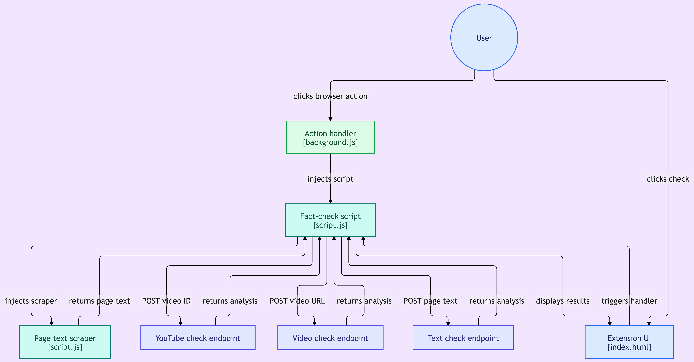
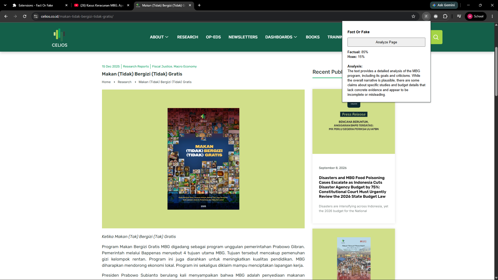
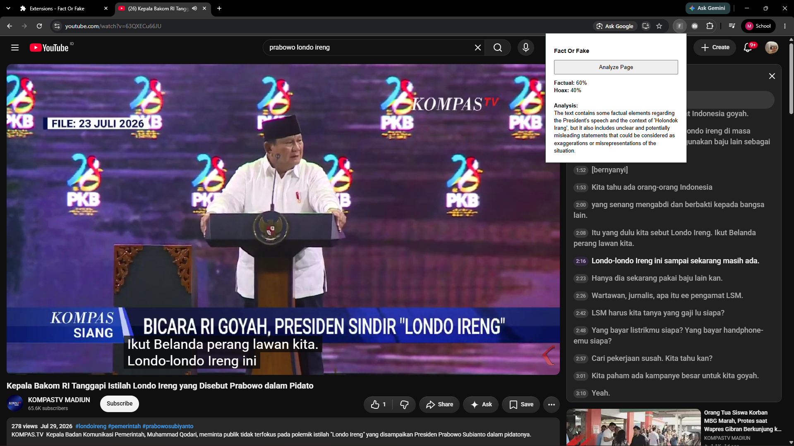
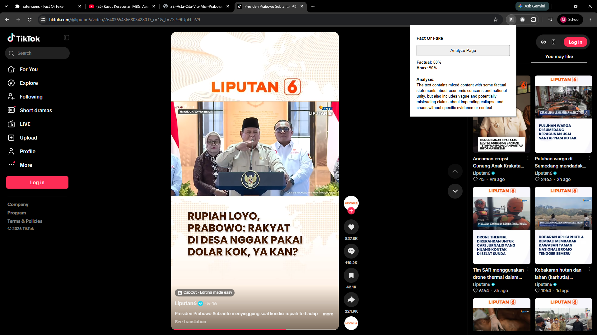

# FactorCake - a Chrome Extension
made by: Michelle - C14240169@john.petra.ac.id

## Konsep Aplikasi
FactOrFake is a Chrome extension that detects a text-based or video-based input of an information that later processed by an LLM (using Qwen/Qwen2.5-7B-Instruct) to predict whether the information is lean towards fake or fact news by giving an output of fact and hoax percantage.

## Tech Stack

    Languange: Python 3
    SDK / Library Client: Hugging Face Transformers, PyTorch, FastAPI, Pyngrok, yt-dlp, youtube-transcript-api
    Execution Environment: Jupyter Notebook (Google Colab)
    Secrets Manager: NGROK_AUTH_TOKEN (google.colab.userdata)
    API Endpoint: FastAPI Server (exposed via Ngrok Tunnel)
    Model: Qwen/Qwen2.5-7B-Instruct (LLM) & openai/whisper-base (STT)

## How is it work (Diagram Mermaid Flow):

## Tampilan popup Chrome Extension:
### Text Based Source (route /fact-check/text)

### Youtube Video Based Source (route /fact-check-youtube)

### Other Video Based Source(route /fact-check-video)

### How To Run
1. Run the `LLM.ipynb` in Google Colab or other Jupyter Notebook runner. Make sure to set your secret keys for the `NGROK_AUTH_TOKEN`.
2. Get the URL of FastAPI from `LLM.ipynb`.
3. Paste the FastAPI URL into the `NGROK_BASE_URL` variable inside the `script.js`. Make sure to remove trailing slash if present '/ at the end.
4. Run the `index.html`.